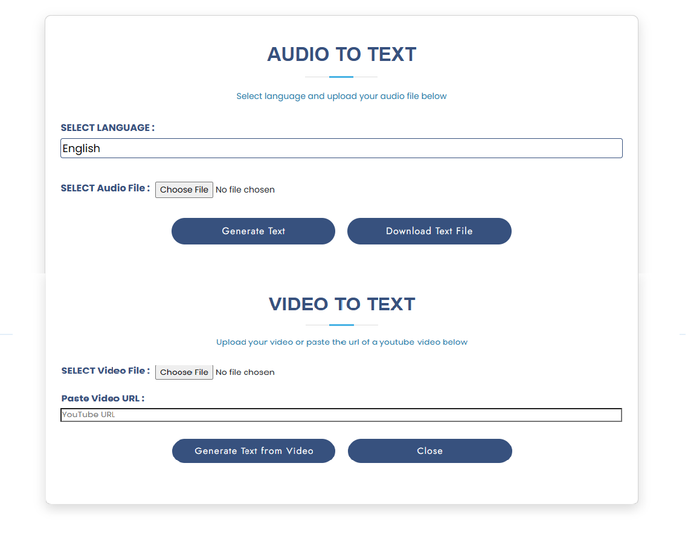

The model used to convert audio to text is [Whisper](https://towardsdatascience.com/speech-to-text-with-openais-whisper-53d5cea9005e), which is an OpenAI pretrained model.
It is a multilingual model trained on 90 plus languages. More details [here](https://github.com/openai/whisper)

In the flask app you first need to specify language and then upload the audio file, on clicking "generate text" button , it will transcribe the text. This text can be downloaded in .txt file using "download text file" button.

For video transcription, you need to specify youtube url, and "generate text" button will generate transcription.  

The Flask application interface looks somehow like this 
